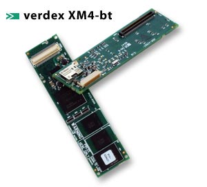

  

[gumstix.com - way small computing](http://www.gumstix.com/store/catalog/product_info.php?cPath=27&products_id=177)

**Processor:** Marvell® PXA270 with XScale™

**Speed:** 400MHz

**Memory:** 64MB RAM / 16MB Flash

**Features:** 
Bluetooth communications ( includes u.fl antenna @ 2.4 GHz ),
USB host signals,
CCD camera signals

**Connections:** 
60-pin Hirose I/O connector,
120-pin MOLEX connector,
24-pin flex ribbon

**Size:** 80mm x 20mm