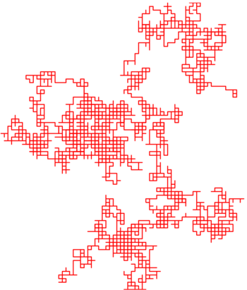

  

[Random walk - Wikipedia, the free encyclopedia](http://en.wikipedia.org/wiki/Random_walk)

I remember some article about periods of extreme regularity in random walks... but don't remember whether periods of regularity are inherent in certain types of truly random walks, or whether it was because the algorithm wasn't really random... 

Surely extreme order and even self-organization can arise from entropic systems - like ripples in the sand on a beach, or stars forming from interstellar dust... hmm...