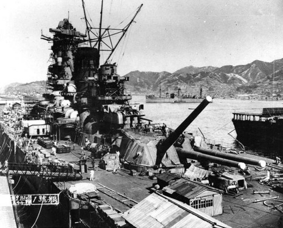

  

"Yamato (大和), named after the ancient Japanese Yamato Province, was a battleship of the Imperial Japanese Navy. She was lead ship of her class. She and her sister Musashi were the largest, heaviest, and most powerful battleships ever constructed, displacing 72,800 tonnes at full load. The class carried the largest naval artillery ever fitted to any warship - 460 mm (18.1 in) guns which fired 1.36 tonne shells."