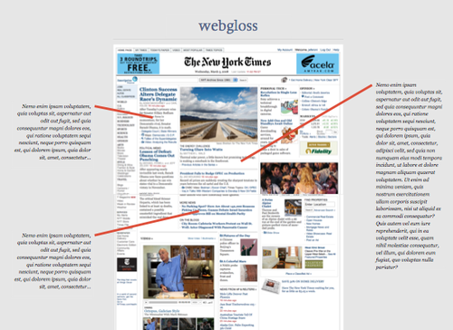

  

Idea: A javascript bookmarklet which looks for references to particular parts of the text and inserts them in the margins in real time like glosses on a medieval manuscript. Perhaps it regex'es clauses and Google Book Searches them.