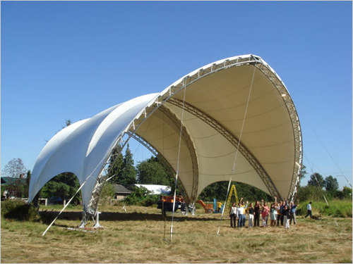

  

The 37-foot-high tent, made in British Columbia, that has been sheltering the Church Street entrance to the World Trade Center PATH station since June 2007. This entrance will close at midnight Friday and the tent will come down.  (Photo: David W. Dunlap/The New York Times)