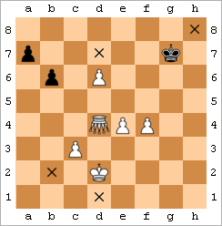

  

[Fairy chess](http://en.wikipedia.org/wiki/Fairy_chess_piece): Grasshopper (shown as an inverted white queen with notation G) must hop over other pieces in order to move or capture. Here, it can capture the pawn in a7.