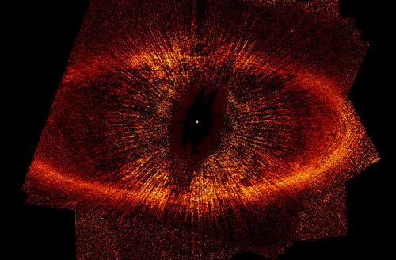

  

[Fomalhaut](http://en.wikipedia.org/wiki/Fomalhaut): (α PsA / α Piscis Austrini / Alpha Piscis Austrini) is the brightest star in the constellation Piscis Austrinus and one of the brightest stars in the night time sky. Its name means "mouth of the whale", from the Arabic فم الحوت fum al-ḥawt. It is a class A star on the main sequence approximately 25 light-years (7.7 parsecs) from Earth.