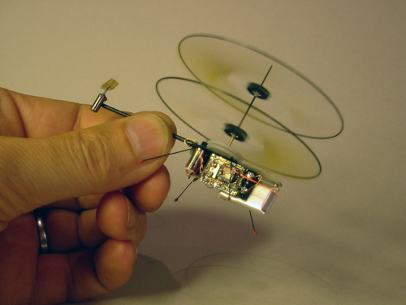

  

[Picoflyer](http://www.proxflyer.com/ph01.htm): The 60 mm rotor diameter, 3.3 grams Picoflyer is the smallest size electric powered contra-rotating coaxial-rotor RC helicopter ever built. It is battery powered and it uses the Proxflyer concept to give it inherent stability. It is built to test how small helicopters using the passively stable rotor concept could be.