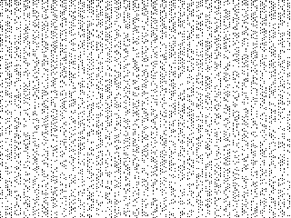

  

[Prime numbers](http://en.wikipedia.org/wiki/Prime_number): "The distribution of all the prime numbers in the range of 1 to 76,800, from left to right and top to bottom, where each pixel represents a number. Black pixels mean that number is prime and white means it is not prime."