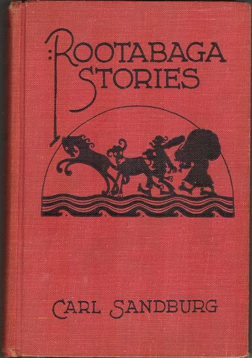

  

[Rootabaga Stories](http://en.wikipedia.org/wiki/Rootabaga_Stories): A large number of the stories are told by the Potato Face Blind Man, an old minstrel of the Village of Liver-and-Onions who hangs out in front of the local post office.