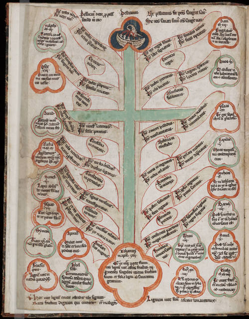

  

[Tree of Life](http://unterbahn.com/wp-content/uploads/2008/06/1v.jpg). Beinecke MS 416 is a late thirteenth-century or early fourteenth-century collection of such didactic diagrams from the Cistercian abbey of Kamp in western Germany.