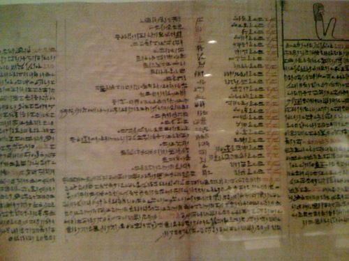

  

Design for tabular data display. Book of the Dead, columns 67-71, chapters 97-102. Circa 350-250 BCE.

"The ancient Egyptians believed that the deceased journeyed to the Hereafter aboard a ferryboat, or aboard the solar bark of Ra. These chapters include prayers to these boats, prayers to summon the ferryboats, and spells for protecting the solar bark of Ra against its enemies. In column 69 the deceased is provided with the names of the different parts of the boat since each part asked the deceased to tell it its name."