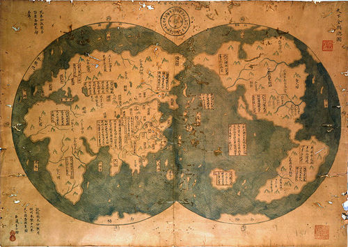

  

Many historians who have responded to Menzies' hypotheses have been strongly critical: "Examination of the book's central claims reveals they are uniformly without substance." ([1421: The Year China Discovered America](http://en.wikipedia.org/wiki/1421_hypothesis))