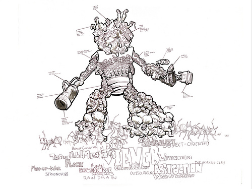

  

Man-of-War -  A human-powered realtime strategy game connecting laborers and consumers in a series of user-generated vignettes. Each scene will make up part of an anatomical body image describing the network topology. Users will be able to farm out labor via Amazon Mechanical Turk system, or conversely, be paid for labor performed.