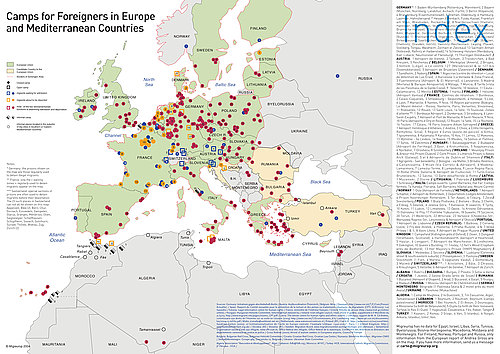

  

<dl>
<dt>"hackitectura is a posse of architects, hackers and social activists experimenting in the emerging territories of recombining spatial cyborgs composed by physical spaces, ICT networks and bodies</dt>
<dt>" - 
</dt>
<dt>hackitectura digital workspace</dt>
<dd>mapa de campos de detención en Europa 1/2
</dd>
</dl>