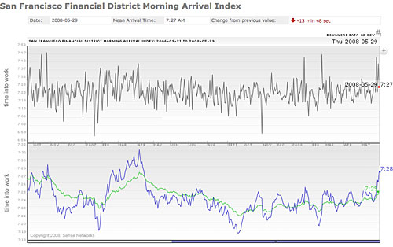

  

Macrosense is the world's first platform capable of collecting and analyzing massive amounts of anonymous, aggregate location data in real-time.

At the heart of Macrosense are powerful machine learning algorithms that process time-stamped location data and metadata streams from heterogeneous sources - GPS, WiFi positioning, cell tower triangulation, RFID and other sensors - and empower companies and investors to better understand and predict human behavior on a macro scale.

[Sense Networks](http://www.sensenetworks.com/macrosense.php)