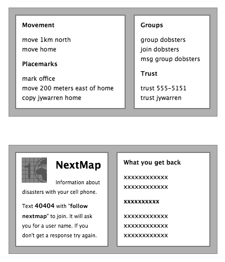

  

Paper handouts with instructions could be the most important interface for disaster response. Even simply warning people to use _only_ SMS in a disaster will keep cell nodes clear because of orthagonality.