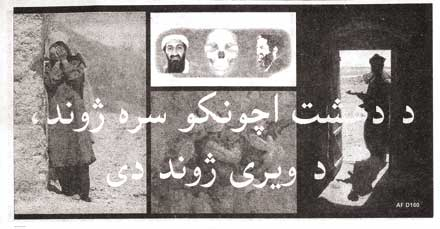

  

The United States Army's 4th Psychological Operations (PSYOP) Group at Fort Bragg, North Carolina, has been responsible for designing the propaganda flyers dropped by air during the recent invasions of Afghanistan and Iraq.

_If we are dealing with a Third World nation with illiteracy, there is no point in going to great pains to produce a first-rate leaflet. Not that this applies, but in Bosnia we dropped leaflets showing big food crates coming down in parachutes and begged them to not stand under the crates (as had happened in Somalia, causing a few deaths). The other answer is that with all the fancy computer software around these days we no longer need to use real artists. Most of the drawings are computer-generated images. You lose a lot when you go CGI._

[Cabinet Magazine Online - Paper Bullets: An Interview with Herbert A. Friedman](http://www.cabinetmagazine.org/issues/12/pefferFriedman.php) (via Caroline Woolard)