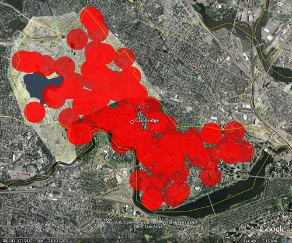

  

"I wanted to explore the idea of excluded space by building a tracker of my own and wearing it in Cambridge. How much of the city is off-limits when the wearer cannot venture within 1,000 feet of a park, school, playground, religious center, or retirement community? Using Google Maps and the GeoPy bindings, I searched for all the restricted areas and plotted a 1000 foot circle around them. As I expected, the wearer is effectively excluded from the entire city; their very presence is illegal." [Josh Levinger : Geo Tracker ](http://web.media.mit.edu/~jlev/Projects/GeoTracker)