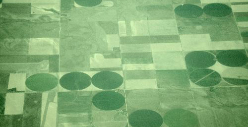

  

What are the logistics governing these examples of farming? How has technology informed the public realm of these processes? How are different forms of farming modifying our regions, cities, buildings, and landscapes?

Fish farms, server farms, energy farms, urban farms, information farms, wikipedia, facebook; our contemporary daily life owes so much to the resourceful, convenient intelligence of collectivity. How is it shaping or how could it shape our cities and buildings? How are these developments shaping our natural environment? And what are new potentials for these typologies? These are the issues and questions that designers and writers are asked to respond to. (via [[architecture, landscape, urbanism, environment, digital culture] ' [bracket ]](http://www.brkt.org/))