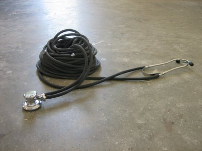

  

A functional stethoscope for listening to heartbeats long distance. Caroline Woolard and Elizabeth Tubergen, [6 Foot Collaboratory: Long Distance](http://6footcollaboratory.blogspot.com/2008/07/long-distance.html), 2008