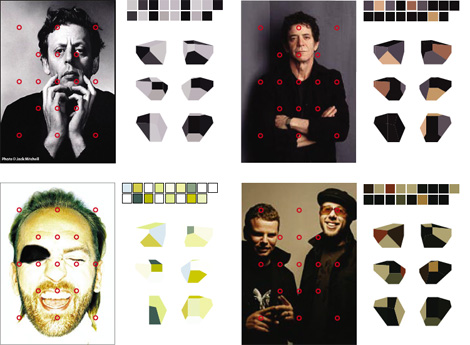

  

Auto-generating palettes by sampling from images - Stefan Sagmeister. [Brand New: The 17 Sides of a Cultural Identity](http://www.underconsideration.com/brandnew/archives/the_17_sides_of_a_cultural_ide.php)