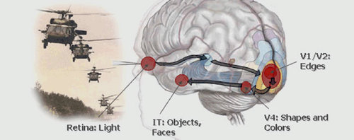

  

Darpa says a soldier's brain can be monitored in real time, with an EEG picking up "neural signatures" that indicate target detection. [Pentagon to Merge Next-Gen Binoculars With Soldiers' Brains ](http://www.wired.com/gadgets/miscellaneous/news/2007/05/binoculars)