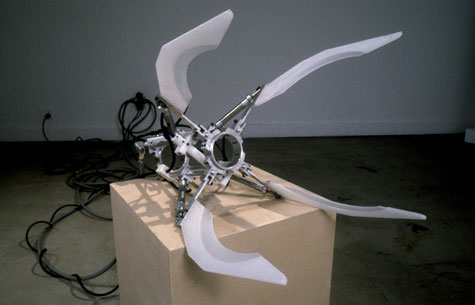

  

superNatural, by Jesse James Arnold:

The superNATURAL series are functional costume prosthetics worn on the arm. The set of behaviors established by the set, serve as a categorical system of gestures drawn from a hybrid history of robots and monster myths.

All of the objects begin with a common base structure. This armature is a cylinder within which is placed the arm of the viewer. Each function within the series demands a specific assembly of parts. The movements that are produced vary in their anthropomorphic qualities. The final gestures are the result of both the direct momentum of the pneumatics, and the material qualities of the extremities. These articulated ends themselves, or the fingers of each arm, are all made from various high-density plastics.

[superNATURAL](http://www.slowbot.com/supernatural/index_super.html)