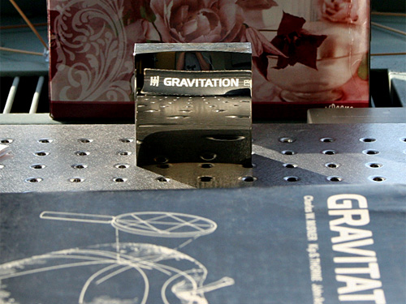

  

This mirror does not produce a "mirror" image, making it possible to read reflected text normally. Hicks, a mathematician at Drexel University, Philadelphia, used computer algorithms to generate the mirror's bizarre surface, which curves and bends in different directions. The curves direct rays from an object across the mirror's face before sending them back to the viewer, flipping the conventional mirror image. As well as neat tricks like this, Hicks' models make it possible to design mirrors that provide wide angled-views or eliminate distortion. (Image: Andrew Hicks) (via [Gallery - The next generation of mirrors - Image 1 - New Scientist](http://www.newscientist.com/gallery/dn16585-amazing-mirrors))