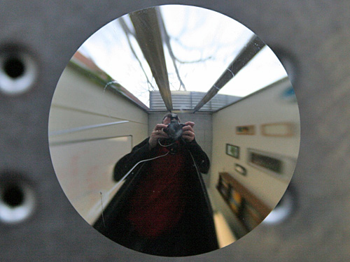

  

This mirror reflects a wide-angled view without distortion - straight lines in the real world translate to straight lines on the convex surface. It was made for a stair-climbing robot at the University of Pennsylvania. A camera pointed at the mirror can see a very wide-angled view in which the stairs appear straight, making navigation easier. (Image: Andrew Hicks) (via [Gallery - The next generation of mirrors - Image 4 - New Scientist](http://www.newscientist.com/gallery/dn16585-amazing-mirrors/4))