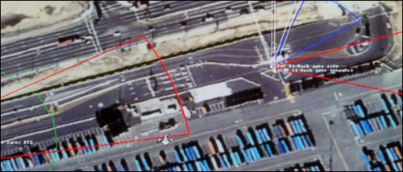

> The camera network - using software from 3VR Security Inc., a San Francisco company that makes surveillance technology - already knew what the houseman looked like; facial recognition algorithms had built a profile of him over time. With a couple of mouse clicks, managers combed through hours of videotape taken that night by the hotel's 16 cameras, and found every place he had been - including the back entrance he slipped out of, three hours into his shift. He became 1 of 10 employees dismissed from the hotel since 3VR's surveillance package was installed last June.

via [The New Security: Cameras That Never Forget Your Face - New York Times](http://www.nytimes.com/2006/01/25/technology/techspecial2/25video.html).