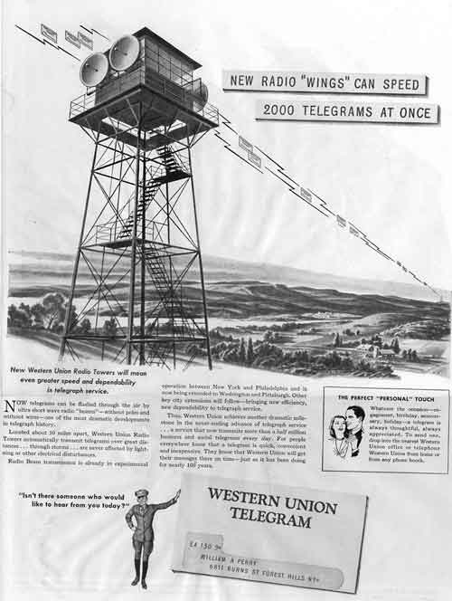

via [David S. Rotenstein ' Towers for Telegrams: The Western Union Telegraph Company and the Emergence of Microwave Telecommunications Infrastructure ' The Journal of The Society For Industrial Archeology, 32.2 ' The History Cooperative](http://www.historycooperative.org/journals/sia/32.2/rotenstein.html).