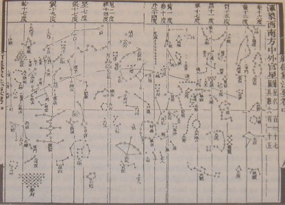

> This is a star map for the celestial globe of Su Song (1020-1101), a Chinese scientist and mechanical engineer of the Song Dynasty (960-1279). It was first published in the year 1092, in Su's book known as the _Xin Yi Xiang Fa Yao_ (Wade-Giles: _Hsin Yi Hsiang Fa Yao_). On this star map there are 14 _xiu_ (lunar mansions) on Mercator's projection. The equator is represented by the horizontal straight line running through the star chart, while the ecliptic curves above it. Note the unequal breadth of the lunar mansions on the map.

via [File:Su Song Star Map 1.JPG - Wikipedia, the free encyclopedia](http://en.wikipedia.org/wiki/File:Su_Song_Star_Map_1.JPG).