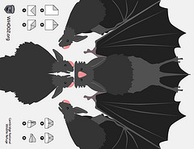
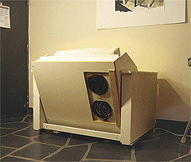
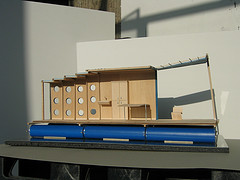

I swear I'm going to update this soon but it's close to a decade out of date.

   

### 
    [WHOOZ.org »](http://www.whooz.org)

    WHOOZ is a project to map urban wildlife in realtime with SMS messages throughout Manhattan, the Bronx, and Cambridge, MA. Users can request realtime 'safaris' to find animals recently seen near their current location.

   

### 
    [ARMSFLOW.org »](http://www.armsflow.org)

    ARMSFLOW is a data visualization which displays arms transactions globally between 1950 and 2006. It includes 14,619 arms transactions (each is a sum of 1 year's exports) and 228 government entities.

### 
    [Kogbox.com »](http://www.kogbox.com)

    Kogbox is a communal programming site where users write short re-usable snippets of code and run them in the cloud. Snippets can be shared and combined to create more complex applications.

   

### 
    [Coffee Analytics »](http://www.flickr.com/photos/jeffreywarren/sets/72157603898358169/detail/)

    A project mapping the flow of coffee on global, urban, local, architectural, biological, and personal scales. The full collection includes over 50 pieces on cardboard, paper, and chipboard in ink, paint, graphite, chalk, charcoal, and coffee.

### 
    Other work:

    I'm a partner at [Vestal Design](http://vestaldesign.com), where I've done lots of stuff like [Xobni](http://www.xobni.com)'s user interface and branding and information design for [ClimateCounts](http://www.climatecounts.org/). I also taught information design workshops for General Electric and Tata Consultancy Services in Mumbai.

    I work occasionally and excitedly with Natalie Jeremijenko as part of her [xDesign Lab](http://www.environmentalhealthclinic.com) at NYU.

    [Weardrobe](http://www.weardrobe.com) is a site for tagging and organizing clothing online, which I created with Suzanne Xie and Richard Tong.

    [Cut&Paste Labs](http://cutpastelabs.com) was founded by Diego Rotalde and me; we taught workshops on web design and development in Lima, Peru. Some went on to found their own firms:

    I've also designed a few zany things which people have enjoyed, like the [DoubleSpace Kitchenette](http://www.vestaldesign.com/design/doublespace-kitchenette/):

   

    as well as the [SHRIMP Refugee Shelter](http://www.vestaldesign.com/design/shrimp-refugee-housing/) (with Alice B. Philips):

  

