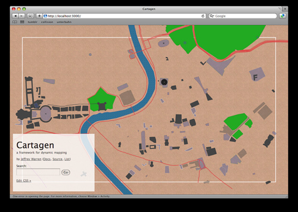

Went to Wherecamp 2009 a day early by mistake... so I had time to add patterns, opacity, and iPhone multitouch to Cartagen before presenting. I love putting maps on a brown paper background...

[Patterns, opacity, and viewport for Cartagen on Flickr](http://www.flickr.com/photos/jeffreywarren/3555545348/).