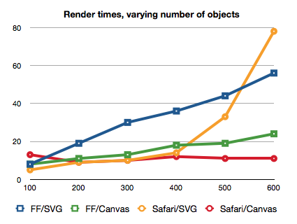

Well, SVG doesn't scale well to large numbers of objects, but Canvas doesn't scale well to large screens:

> 
> 
> 
> Here are the results of the first fruitful experiment, which clearly shows that SVG performance degrades quickly (exponentially on Safari?) in the number of objects, but Canvas performance remains at a near-constant low. This makes sense, since Canvas is just a bitmap buffer, while SVG has to maintain additional references to each object that it renders. Also, though not pictured, note that performance in clearing an SVG element also decreases in the number of drawn objects.
> 
> 
> 

Via [Boris Smus](http://www.borismus.com/canvas-vs-svg-performance/)