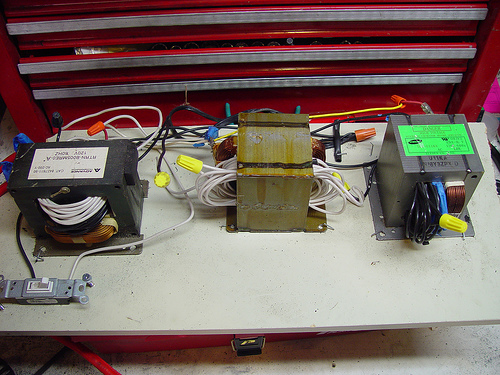

The guy who made the astonishing [DIY clone](http://www.flickr.com/photos/25435483@N00) of an [Ariel Atom](http://arielatom.com/) also made this homebrew welder from 3 old microwaves. It blew his circuit breakers, but imagine building these in low-cost shops in the developing world!