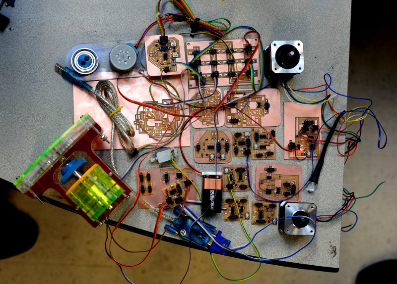

Jon's been creating a webserver-based controller for low-cost fabrication tools - you can actuate different motors via a web page... crazy.

[Read more...](http://fab.cba.mit.edu/classes/MIT/961.09/people/jonathan/)