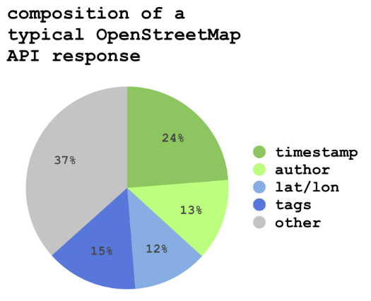

I've been wondering how much of the data transferred by the OpenStreetMap API is actual geometric data as opposed to timestamp and author data. I ran some rough numbers on a typical API response (in JSON, not XML, though these are relative measurements, so it shouldn't matter too much). The file I examined is here: [dr5ru0.json](http://unterbahn.com/wp-content/uploads/2009/09/dr5ru0.json) but my count is by number of characters and I did include formatting.

