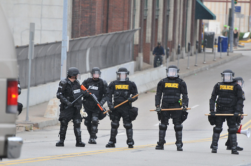

> A New York-based anarchist has been arrested by the FBI and charged with hindering prosecution after he allegedly used the social networking site Twitter to help protesters at the G20 summit in Pittsburgh evade the police.
> 
> 
> Elliot Madison, 41, from Queens, had his home raided and was put on $30,000 (£19,000) bail after he and Michael Wallschlaeger, 46, were tracked to the Carefree Inn motel in Pittsburgh during the summit on 24 and 25 September.
> 
> 
> The pair were found sitting in front of a bank of laptops and emergency frequency radio scanners. They were wearing headphones and microphones and had many maps and contact numbers in the room.
> 
> 
> Official police documents allege the two men used Twitter messages to contact protesters at the summit "and to inform the protesters and groups of the movements and actions of law enforcement".
> 
> 
> In all, almost 200 protesters were arrested during the two-day summit, which brought world leaders to Pittsburgh to discuss the global economic meltdown and other matters of common financial interest.
> 
> 
> --[Guardian.co.uk](http://www.guardian.co.uk/world/2009/oct/04/man-arrested-twitter-g20-us)