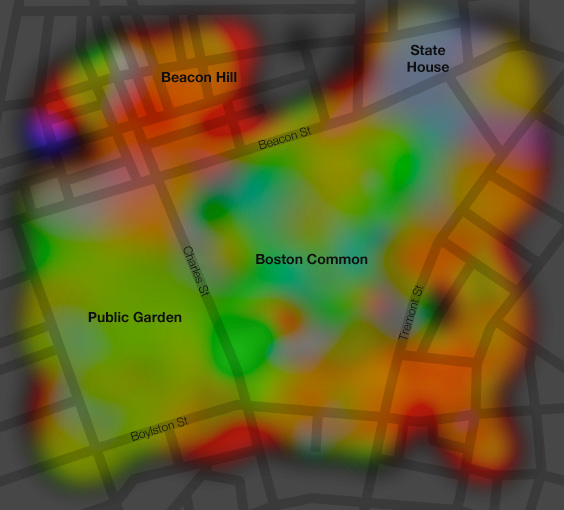

> This is not simply a map of the colors on the ground, which you can get from an aerial photo or systematic documentation like Google Street View, but rather a map of the colors that people on the ground are looking at.
> 
>  . . . . 
> 
> Quite simply, I've grabbed about 2,000 photos in each location from Flickr, determined the dominant color in each, mapped those colors, and interpolated liberally.

[Cartogrammar.com](http://www.cartogrammar.com/blog/)