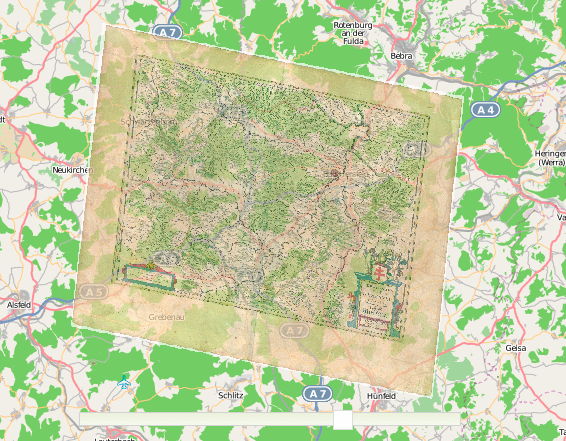
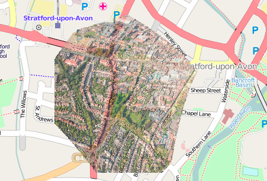

There was a Boston OSGeo meetup last night at the Media Lab, and Shekhar Krishnan, Tim "Chippy" Waters, and Schuyler Erle showed some of their fantastic work on the New York Public Library Map Rectifier, which should be public sometime soon. Until then, you can use Map Warper, which Chippy is running as a separate site for anyone to upload and rectify maps on. We're going to try it soon with some weather balloon photography; I ordered balloons yesterday.

[http://warper.geothings.net](http://warper.geothings.net)

