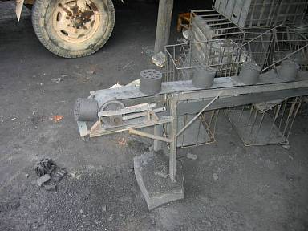

[Tim Anderson](http://www.instructables.com/member/TimAnderson/) says:

> The Chinese make very effective cooking fuel briquettes from waste cellulose and carbon materials, using local clay for a binder.
> 
> The briquettes are cylindrical with a number of air passages through them.
> 
> An expat living here told me he had a water heater in Germany in the 1960's that used the same type of briquettes.

[Tim's page on the machine](http://www.mit.edu/people/robot/travels/china_carbon/china_carbon.html).