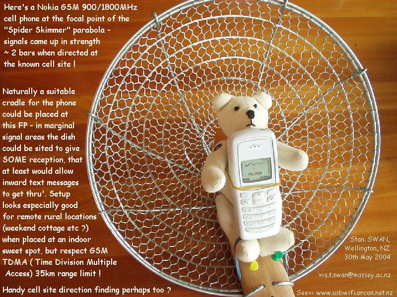

via [usbwifi.orconhosting.net.nz](http://www.usbwifi.orconhosting.net.nz/), thanks [JB](http://web.media.mit.edu/~labrune/)!

Note the advisory to connect only under 35km - the limit of Time Division Multiple Access (TDMA).