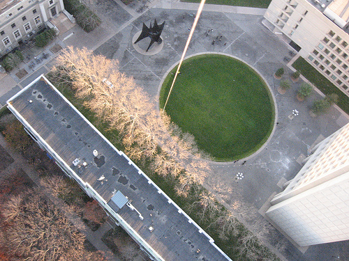
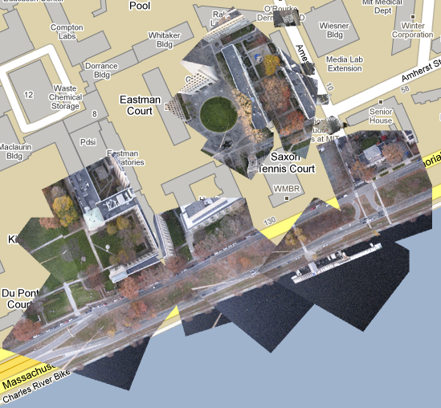
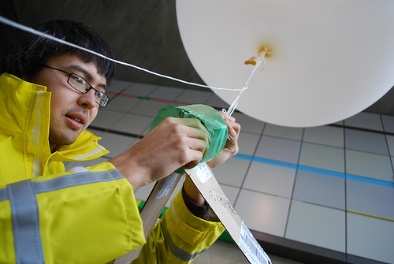
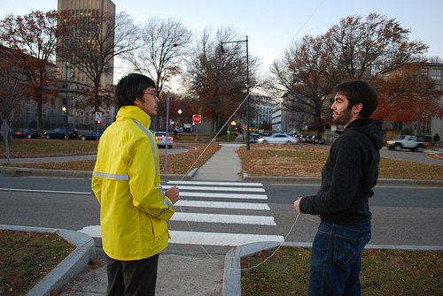

[Josh Levinger](http://www.levinger.net/josh/) of [GroundTruth](http://groundtruth.media.mit.edu/) and I tested our larger 8 foot balloon yesterday, and it was a huge success! We ran all the way through our spool of string, and got some great images before the light got too dim. I rectified them using [Map Warper](http://warper.geothings.net/) (fantastic!) and we now have a mostly continuous 'scan' of our flight. 

This means this can be a viable way to capture high-resolution geolocated imagery at low cost! I spent under $100 on the equipment - $30 for the balloon, $40 for the camera, $5 for the helium, and a few bucks for string. I bet it could be done for under $50 with a cheaper camera and perhaps trash bags instead of latex balloons. We'll be trying that soon - I'd guess we need about 10 of these [98-gallon bags](http://www.ourshippingsupplies.com/productDetails.asp?id=LD-1525R-RC).  I also turned the ISO way up for this because the light was failing, so the photos are pretty grainy. This camera doesn't have shutter speed settings, though I'm still playing around with the [CHDK](http://chdk.wikia.com/) settings so maybe I'll do better next time.

I'm excited to test this in an area that really does not have good aerial imagery, like outside [Lima, Peru](http://maps.google.com/maps?f=q&source=s_q&hl=en&geocode=&q=nuevo+invasion&sll=-12.093084,-77.046491&sspn=0.733173,1.09314&g=lima+peru&ie=UTF8&hq=nuevo+invasion&hnear=Lima,+Peru&ll=-12.214184,-76.919918&spn=0.002863,0.006314&t=h&z=18). 

See all the pictures at full resolution here: [Balloon aerial photography on Flickr](http://www.flickr.com/photos/jeffreywarren/sets/72157622791135220/)

See some great photos from the ground by [Christina Xu on Flickr](http://www.flickr.com/photos/crimsonninjagirl/sets/72157622707750293/)

