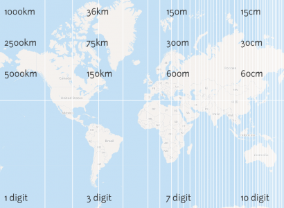

The _Geohash_ algorithm is a useful way to describe locations on the earth using a single string of a-z, 0-9 characters. They can be thought of as rectangular subdivisions of the Earth's surface. Learn more here: [Geohash at Wikipedia](http://en.wikipedia.org/wiki/Geohash). They were invented by Gustavo Niemeyer in 2008.

It's good to get an idea of how large a rectangle a given geohash describes, but this changes depending on your latitude. At the equator, geohashes are biggest, so you need more characters to describe an area of a given size, or a location of a given precision.

In Cartagen I'm using geohashes to report geodata by text message, so it's very useful to know how long your geohash code will be to describe, say, the area of a building, a soccer field, or a street corner. I did a quick calculation for the equator, which is the worst-case scenario:

### Dimensions of geohashes of length _n_:

<table><thead><tr><th>N</th><th>Longitude</th><th>Latitude</th><th>east/west distance at equator</th><th>north/south distance at equator</th></tr></thead><tbody><tr><td style='text-align: left;'>12:</td><td style='text-align: left;'>0.00000033527612686157227</td><td style='text-align: left;'>0.00000016763806343078613</td><td style='text-align: left;'>~3.7cm</td><td style='text-align: left;'>~1.8cm</td>

</tr><tr><td style='text-align: left;'>11:</td><td style='text-align: left;'>0.000001341104507446289</td><td style='text-align: left;'>0.000001341104507446289</td><td style='text-align: left;'>~14.9cm</td><td style='text-align: left;'>~14.9cm</td>
</tr><tr><td style='text-align: left;'>10:</td><td style='text-align: left;'>0.000010728836059570312</td><td style='text-align: left;'>0.000005364418029785156</td><td style='text-align: left;'>~1.19m</td><td style='text-align: left;'>~0.60m</td>
</tr><tr><td style='text-align: left;'>9:</td><td style='text-align: left;'>0.00004291534423828125</td><td style='text-align: left;'>0.00004291534423828125</td><td style='text-align: left;'>~4.78m</td><td style='text-align: left;'>~4.78m</td>

</tr><tr><td style='text-align: left;'>8:</td><td style='text-align: left;'>0.00034332275390625</td><td style='text-align: left;'>0.000171661376953125</td><td style='text-align: left;'>~38.2m</td><td style='text-align: left;'>~19.1m</td>
</tr><tr><td style='text-align: left;'>7:</td><td style='text-align: left;'>0.001373291015625</td><td style='text-align: left;'>0.001373291015625</td><td style='text-align: left;'>~152.8m</td><td style='text-align: left;'>~152.8m</td>
</tr><tr><td style='text-align: left;'>6:</td><td style='text-align: left;'>0.010986328125</td><td style='text-align: left;'>0.0054931640625</td><td style='text-align: left;'>~1.2km</td><td style='text-align: left;'>~0.61km</td>

</tr><tr><td style='text-align: left;'>5:</td><td style='text-align: left;'>0.0439453125</td><td style='text-align: left;'>0.0439453125</td><td style='text-align: left;'>~4.9km</td><td style='text-align: left;'>~4.9km</td>
</tr><tr><td style='text-align: left;'>4:</td><td style='text-align: left;'>0.3515625</td><td style='text-align: left;'>0.17578125</td><td style='text-align: left;'>~39km</td><td style='text-align: left;'>~19.6km</td>
</tr><tr><td style='text-align: left;'>3:</td><td style='text-align: left;'>1.40625</td><td style='text-align: left;'>1.40625</td><td style='text-align: left;'>~157km</td><td style='text-align: left;'>~157km</td>

</tr><tr><td style='text-align: left;'>2:</td><td style='text-align: left;'>11.25</td><td style='text-align: left;'>5.625</td><td style='text-align: left;'>~1252km</td><td style='text-align: left;'>~626km</td>
</tr><tr><td style='text-align: left;'>1:</td><td style='text-align: left;'>45</td><td style='text-align: left;'>45</td><td style='text-align: left;'>~5018km</td><td style='text-align: left;'>~5018km</td>
</tr></tbody></table>

I think this is right but if you find an error please tell me. I put it up on the Cartagen Wiki here: [GeoHashes](http://wiki.cartagen.org/wiki/show/GeoHashes)

**Update:** if you want to know how big a geohash is near you, it's a bit tough - it varies depending on what latitude you're at. Someone ought to make a nice map of geohash sizes, like this one which is NOT to scale or using real values... it's just a sketch:

