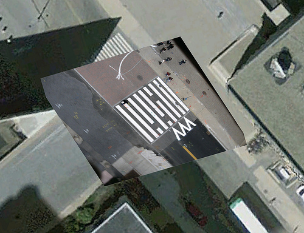
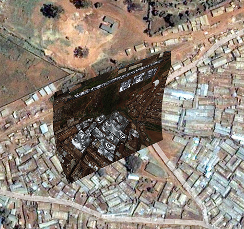

I've been taking very high-res imagery from a weather balloon and rectifying it, but the OpenStreetMap data isn't detailed enough to find rectifying points... the result is a bit like this:

To add a Google layer, just run:

<pre>to_map.addLayer(googleSat,{'maxZoomLevel':22});</pre>

or drag this bookmarklet into your browser bookmarks bar, and click the bookmark when you're on the Rectify page:

[google-for-warper](javascript:to_map.addLayer(googleSat,{)

The result is something like this:

