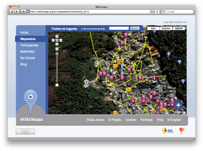

MobileActive covered a project called [Wikimapa](http://wikimapa.org.br/mapeados?community_id=5) by [Rede Jovem](http://www.redejovem.org.br/), where teenagers use Nokia N95 phones to map unmapped areas of Rio de Janiero.

The project cost $87,310. The evaluation section of the article was interesting:

> The most challenging part of the project was developing the mobile application.  The organization is still working to develop versions for other operating systems.  Having a long-term, sustainable budget is also challenging.  The project was unsuccessful in getting grants from Nokia -- they bought the phones themselves -- and currently doesn't have any money to sustain the project beyond December.  Because the project doesn't actually make money, they are dependent on grants and its unlikely to be scalable or sustainable. -- [MobileActive.org](http://mobileactive.org)

I'm going to contact the organizers and see if  they'd like to use some of the techniques we're prototyping now.

[Rede Jovem](http://mobileactive.org/case-studies/rede-jovem-wikimapa) (via [MobileActive.org](http://mobileactive.org))