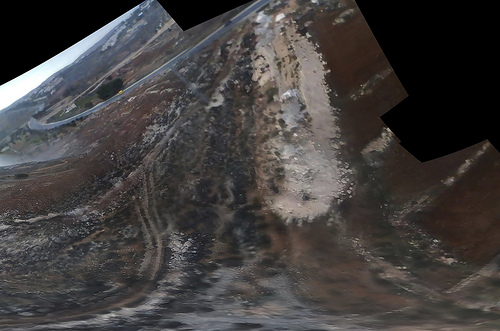
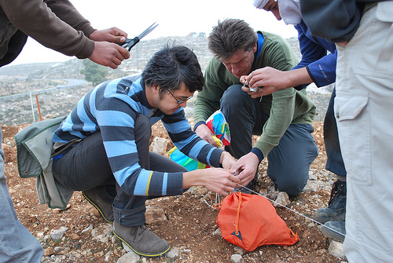
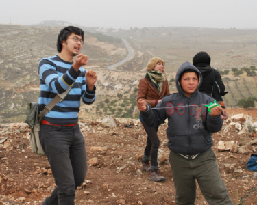

Josh Levinger and I met up with some activists  who were planting trees in Umm Salamuna ([view in Google Maps](http://maps.google.com/maps?f=q&source=s_q&hl=en&geocode=&q=Bethlehem,+Israel&sll=37.0625,-95.677068&sspn=20.902146,56.513672&ie=UTF8&hq=&hnear=Bethlehem,+Israel&ll=31.646769,35.158825&spn=0.005462,0.021973&t=h&z=16)) on a hillside which is scheduled to be annexed by a nearby Israeli settlement, and converted into a graveyard. The planting was organized by Alice Gray of [Bustan Qaraaqa](http://www.bustanqaraaqa.org/), so that if the land is taken over, the trees would have to be uprooted or chopped down before the land can be used.. As I understand it, one of the means by which settlements claim land is by using an Israeli law which opens land to new settlement if it has lain fallow for more than three years -- so planting the hillside may defend it from such a claim.

The wind was so strong that our first kite, carefully made that morning from dowels and Tyvek, shattered immediately. Instead, we launched a small soft kite with an iPod nano attached to it. Here's a stitched image of the video footage we captured:

See all the pictures [on Flickr](http://www.flickr.com/photos/jeffreywarren/sets/72157622888113813/).

The iPod has an SD camera which can capture many hours of video - and it's so super light that we can fly it on a pocket kite. Many of the frames are blurred and the resolution is pretty poor (we'd thought of using a Flip camera but they're more expensive and heavier) but when you go through the footage frame by frame you can find lots of good images. We then stitched these together with Calico and got the above image. It helped a lot to put a small 'sail' on the back of the iPod so it didn't spin as much.

Everyone was cold but once we started flying the kites we all got really excited. The owner of the land was there with his kids and they helped assemble the rig and fly the kite:

The mapping was a big success - everyone 'got' why we were doing it, that documenting the tree planting and how they're changing the landscape is a form of testimony. We're still working to rectify the imagery, and I'd like to ask folks if they have any ideas - the stitching software we're using assumes images were taken from a single viewpoint, but the kite and camera were moving all over the place. As you can see above, the stitching distorts things and we lose a lot of detail - how can we reconstruct a high-res image that assumes multiple perspectives? I'm looking at [this tutorial](http://hugin.sourceforge.net/tutorials/scans/en.shtml) to start with. We're also thinking about an algorithm to dump the clear, undistorted and unblurred frames from a movie file. Ideas?

_Update: We'll be adding this material to the [Grassroots Mapping wiki](http://grassrootsmapping.org), where we're putting together a comprehensive guide on low-cost participatory mapping techniques. Our hope is that we can offer a Grassroots Mapping Kit which people can use to reproduce these techniques to explore and document their own geographies no matter where they are._

_Cross-posted with the [Center for Future Civic Media blog](http://civic.mit.edu/blog/warren/grassroots-mapping-in-palestine)_