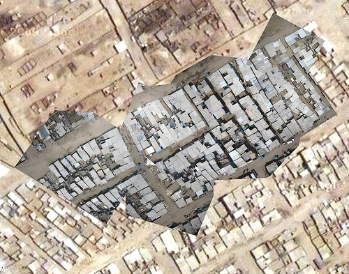
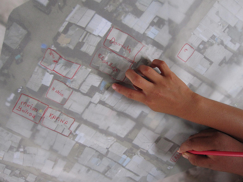
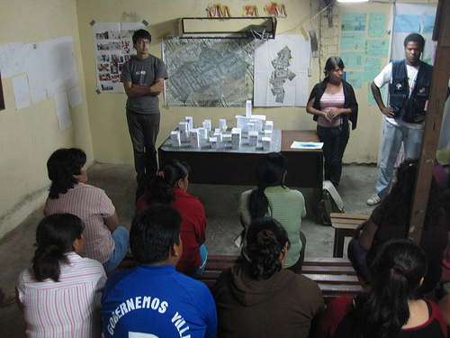
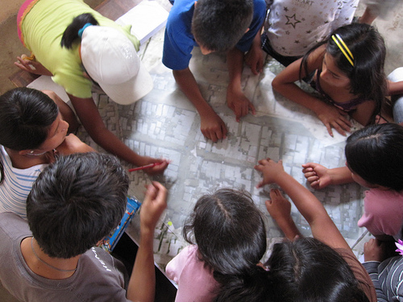
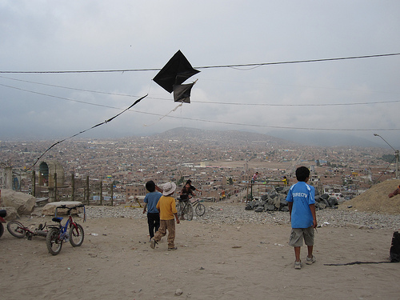

Late Wednesday I finally finished the first draft rectification of the kite/balloon images from Juan Pablo II and also of Cantagallo; I took a cab out to Surco to where they have plotters and ran off a couple big maps for each community. On Thursday, Carla, Nancy, and the CEDRO teachers stayed out the whole day in Villa el Salvador because there was a parent teacher meeting at 6pm. In the meantime we got out the big map and all the kids found their homes (just like in Google Maps, right?) and outlined them on trace paper.

The best part of the day was meeting the parents and showing them all the great work the kids had done on both the history &#8220;project&#8221; and the &#8220;future&#8221; project. The model of the community in 7 years (as mentioned in a [previous post](http://grassrootsmapping.org/2010/01/history-future-of-juan-pablo-ii/)) was especially exciting. See all pictures of the history/future projects [on Flickr](http://www.flickr.com/photos/jeffreywarren/sets/72157623292820418/).

And finally, we presented the completed map of Juan Pablo II to the parents as well. Since the kids had outlined homes and such, we were able to show the president of the community (several of the leaders came) a completed map with annotations. He seemed pretty excited and we&#8217;re meeting up with him on Tuesday to talk more about it, and possibly stitch the map we&#8217;ve made onto an overall community plan they already have. This should help them fill in detail like homes and streets.

The meeting was at night, so we had a free afternoon, giving Cesar, Jesus, Jian, and a bunch of other kids the chance to build a really huge kite from bamboo and trash bags. 

The kites didn&#8217;t all fly (Cesar&#8217;s did!) but we learned a bit about what makes a good kite. Next time we&#8217;ll try for a really huge one that is still stable. 