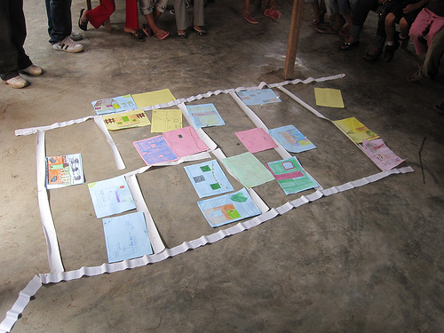
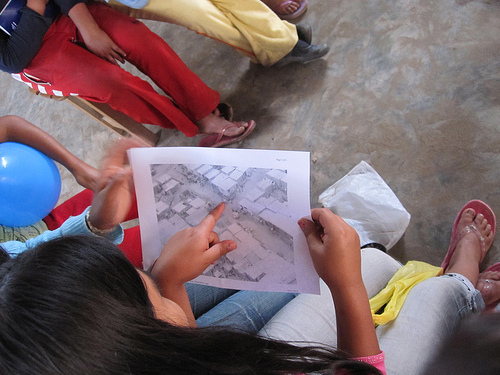

Quick update &#8211; we&#8217;re continuing to fly kites and take pictures but we&#8217;re waiting for our &#8216;perfect day&#8217; of kite flying&#8230; so far we&#8217;ve had a rough time with the wind and haven&#8217;t yet gotten the cameras high enough to take an overall picture. But we&#8217;re trying again Saturday in Juan Pablo II. Above, we asked the kids to draw pictures of their houses, and as a group activity, we organized them into a map to get a better idea of how the community is shaped.

Tomorrow I&#8217;ve been invited by some activists and artists I met at [Escuelab](http://escuelab.org/) to come out to a community called Cantagallo in the center of Lima, where an entire community from the Amazon region of Peru has relocated as a block to the bank of the river Rimac. They&#8217;re doing a project there and are really excited about making a map &#8211; and the community is looking to establish legal tenure.  Perfect! I&#8217;ll post some pictures on Saturday.

Below, Sandy from CEDRO examines an aerial photograph we took last Thursday. Since the Google imagery, the residents of Juan Pablo II have added an entirely new street, and completely reorganized their homes&#8230; the Google map is badly outdated.

