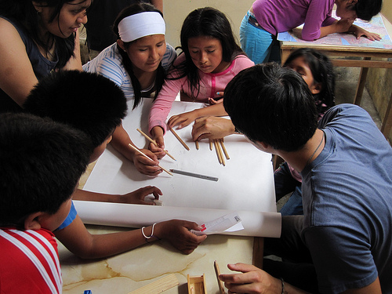
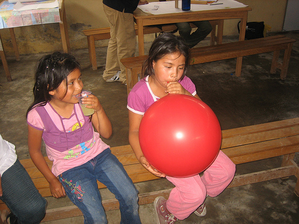
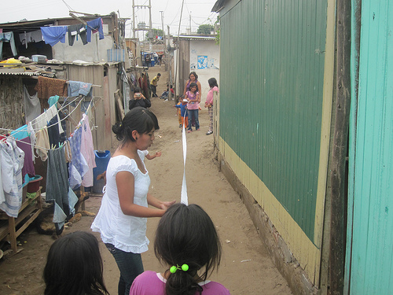
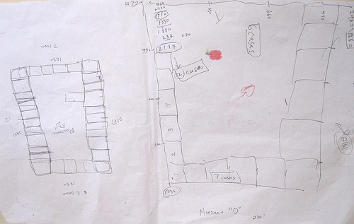
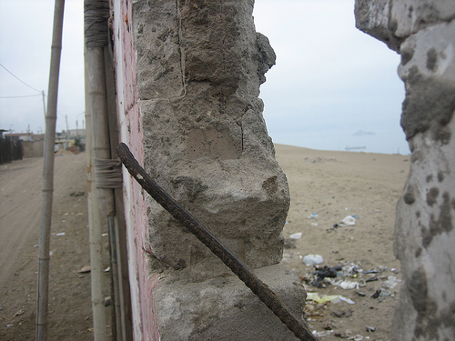

Yesterday we had our first mapping session with the kids from Juan Pablo II, the invasion we&#8217;re working in. Carla took Seth and I up to Villa el Salvador, and after walking around a bit to get oriented, we met up with Ernesto, Sandy, Sara, Nancy, and Johann, who are doing the project with us. We spent some time gathering kids up (quite a few had to work today, so we had a smaller class of about 8), and then got right down to drawing maps. The kids enjoyed debating where they lived and how far away, and we ended up with a nice map that was not so literal, but got them oriented a bit and in the mapmaking mind-set.

Then the others had a great idea, and we all set to making some long tape-measures from some large sheets of 1 inch graph paper. This took a while but the kids were very efficient and we broke into groups of 2-3 to measure some of the &#8216;manzanas&#8217; or blocks that the homes are divided into. 

Each block has about 10-15 homes, and we measured them to the inch! It&#8217;ll be fun to see how these hand-measured maps match up to the aerial pictures we hope to take. 

The kids got all tired out and to tell the truth, so did the adults. We finished up with the kids and then had a wrap-up meeting where we talked about scheduling the next few classes, discussed what worked and what didn&#8217;t (the kids seemed to lose interest in measuring things after about 20 mins or so&#8230; especially as it got towards lunchtime) and planned out some more activities. We hope to do a balloon launch on Thursday, but we&#8217;ll see how the weather looks. 

Anyways thanks to everyone who participated for a fantastic and gratifyingly exhausting first day! Seth and I are posting more photos [on Flickr](http://www.flickr.com/photos/tags/grassrootsmapping/). 

Here&#8217;s a great picture of the wall at the edge of the invasion which separates the community from the ocean:

_

### Related Posts:

*   [Continued kite-flying and paper mapping](http://grassrootsmapping.org/2010/01/continued-kite-flying-and-paper-mapping/)
*   [Landed in Lima, found helium](http://grassrootsmapping.org/2010/01/landed-in-lima-found-helium/)
*   [Mapping with balloons, kites, and kids &#8211; first flights with Juan Pablo II in Lima](http://grassrootsmapping.org/2010/01/mapping-with-balloons-kites-and-kids-first-flights-with-juan-pablo-ii-in-lima/)
*   [Possible legal role for grassroots mapping in Lima](http://grassrootsmapping.org/2010/01/possible-legal-role-for-grassroots-mapping/)
*   [Completed, printed map of Juan Pablo II!](http://grassrootsmapping.org/2010/01/completed-printed-map-of-juan-pablo-ii/)_
