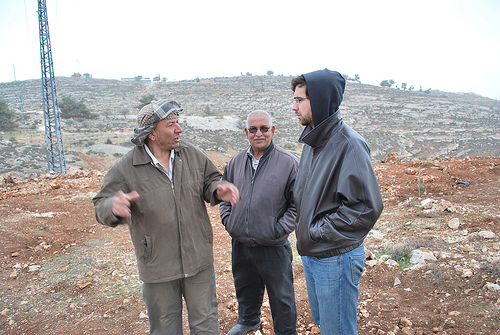

Here are some quick updates from Alice Gray at [Bustan Qaraaqa](http://bustanqaraaqa.org). First, news of Abed's farm at Um Salamoneh (I'd [written about it earlier](http://unterbahn.com/2009/12/umm-salamuna-kite-mapping-test/) under the name Umm Salamuna where we did kite mapping):

> We also organized tree-planting days at Bustan Qaraaqa, at Abed's farm in Al Wallaja and in Um Salamoneh, on land threatened with confiscation to make way for an Israeli cemetery. Abed's situation has improved quite significantly since our last newsletter, as his lawyer has managed to secure him a blue Jerusalem ID. This means that he is now legally entitled to be present on his land, although there is still a serious threat from Israeli real-estate developers, who continue to push for his expulsion to make way for settlement expansion. This season we were able to raise enough money to install a rainwater harvesting system at Abed's, donating 2 water tanks (thanks Imo!), and are still working on a project to create a greenhouse outside the cave.

(Above, a photo of Abed and Jared)

Unfortunate news, however, about friends Jared and Faith, who were such good hosts when Josh and I visited:

> The latest move in what seems to be a sinister trend aimed at silencing dissent and removing 'witnesses' to Israel's occupation of the Palestinian Territories, has been the denial of entry to international NGO workers and journalists based in the West Bank. Many such people had been out of the country over Christmas and were refused entry at Ben Gurion airport when they attempted to return to their homes and jobs. Among the 'casualties' of this policy were our dear friends Jared Malsin (chief editor of the [Maan News English Desk](http://www.maannews.net/eng/Default.aspx)) and Faith Rowold (Public Relations officer of [Dar Annadwa](http://www.annadwa.org/en/index.php?option=com_frontpage&Itemid=1)) who had been on holiday in Prague. Faith was immediately deported to Prague, whereas Jared spent a week in detention attempting to contest his case on grounds of 'freedom of the press' before he too was put on a plane and flown out ([read story here](http://www.maannews.net/eng/ViewDetails.aspx?ID=253864)). 
> 
> 
> Jared and Faith, like many internationals, were living and working in the Palestinian Territories on Israeli tourist visas, being unable to obtain work permits from Israeli authorities. They were deported for 'refusing to cooperate' during their interrogation at Ben Gurion airport; yet they were placed in this position by Israeli authorities themselves who would not give them the necessary visas to pursue their legitimate work and have a long history of refusing entry to people admitting to connections with Palestinian organisations or individuals. Recently, Israel has stopped issuing work permits to all West Bank based NGOs including Oxfam, Save the Children, Doctors Without Borders and Handicap International, forcing all foreign employees to rely on tourist visas ([see story here](http://www.maannews.net/eng/ViewDetails.aspx?ID=253864)) and placing them in a very precarious position.

That sucks. You can also read about it at the [Washington Post](http://www.washingtonpost.com/wp-dyn/content/article/2010/01/20/AR2010012002922.html). Good luck, Jared and Faith!