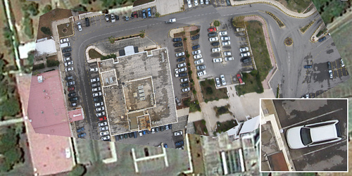
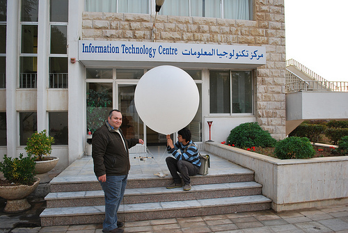
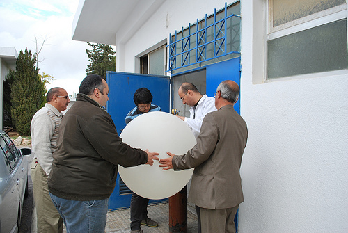
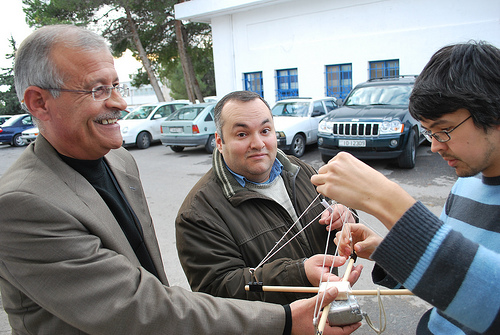
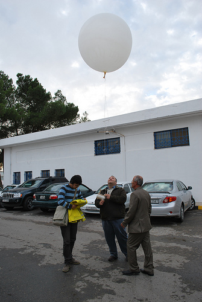

_(Cross-blogged at [the Center for Future Civic Media dev-blog](http://dev-civic.media.mit.edu/2010/01/11/grassroots-mapping-at-the-royal-scientific-society-of-jordan/)) Following up on our trip to the West Bank, Josh Levinger and I were hosted by Edward Jaser of the RSS in Amman to demo some grassroots mapping techniques. Ed was a fantastic host (thanks again!) and has sent in the following summary on the experiments we did. Note in the above picture the absolutely fantastic resolution we got (click for full size) as opposed to the standard Google imagery at the edges of the picture. _

> It all started when the &#8220;Innovations in Mobile Data Collection in the Middle East&#8221; event took place in Amman from 8th Dec. to 10th Dec 2009. There was an interesting presentation on low-cost mapping techniques and many people showed interest in the subject. There was excitement among participants regarding a plan to do a live demonstration experiment on low cost mapping during the event. However, a big balloon equipped with a camera flying in the sky of Amman is (I think) an unprecedented event and the organizers and I were not sure about the reaction to this &#8212; and we were not sure how to get the necessary approval, or if that were even possible.

> I work for the Royal Scientific Society (RSS) which is a research institute in Jordan and it has a large and protected campus. I thought we could have a bit of privacy and freedom to conduct the experiment within the campus so we decided to give it a try. Jeff and Josh kindly visited the RSS on Monday, December 14th to conduct, I believe, the first low-cost mapping experiment in Jordan.

> One issue was to find helium for the balloon. I have never shopped for helium before (I never thought I would) and I didn't have the slightest idea where to get it from. We thought of going to a flower shop and asking there. We asked my colleagues about a nearby shop and one colleague suggested we first ask the Industrial Chemistry Center at the RSS if they have helium. Luckily, and surprisingly, the center had plenty of helium and it also had friendly staff and so we managed to get the balloon filled (for free).

> We were extremely lucky with the weather and the wind and so the conditions were just perfect. It was quite interesting watching Jeff and Josh equip the balloon with the camera and calibrating the movement mechanism and they were generous in explaining the steps. Finally the balloon started rising elegantly above the RSS to reach the needed height &#8212; approximately 500 feet. We walked around the campus and navigated the balloon to cover as much as possible from the RSS, during which we had to answer questions from many curious people who were wondering what on earth we are doing with the balloon. 
> 
> Finally, the journey of the white balloon above the RSS came to an end and we were excited to see the outcome. Without a doubt, the data collection part of the experiment was a great success and most of the images we got were fantastic. Jeff and Josh demonstrated how to use the open source Map Warper to upload images and rectify them against a map. What we ended up with was many times better than what is available on Google Earth. 
> 
> For few days after the experiment and I was still getting phone calls from people asking about the white balloon above the RSS. I showed the excellent result we got to some students and researchers at the university I lecture in, and there is great interest now to repeat the experiment.

_See all the pictures here: [Grassroots Mapping at the RSS on Flickr](http://www.flickr.com/photos/jeffreywarren/sets/72157623182467142/), and many thanks to the [Map Warper](http://warper.geothings.net) team for their fantastic tool!_

_

### Related Posts:

*   [Kite-video generation of aerial imagery](http://grassrootsmapping.org/2010/01/kite-video-generation-of-aerial-imagery/)
*   [Umm Salamuna kite mapping](http://grassrootsmapping.org/2009/12/umm-salamuna-kite-mapping/)
*   [Grassroots Mapping with the Shipibo in the center of Lima](http://grassrootsmapping.org/2010/01/grassroots-mapping-with-the-shipibo-in-the-center-of-lima/)
*   [Mapping with balloons, kites, and kids - first flights with Juan Pablo II in Lima](http://grassrootsmapping.org/2010/01/mapping-with-balloons-kites-and-kids-first-flights-with-juan-pablo-ii-in-lima/)
*   [Grassroots Mapping Wiki launched](http://grassrootsmapping.org/2009/12/grassroots-mapping-wiki-launched/)_
